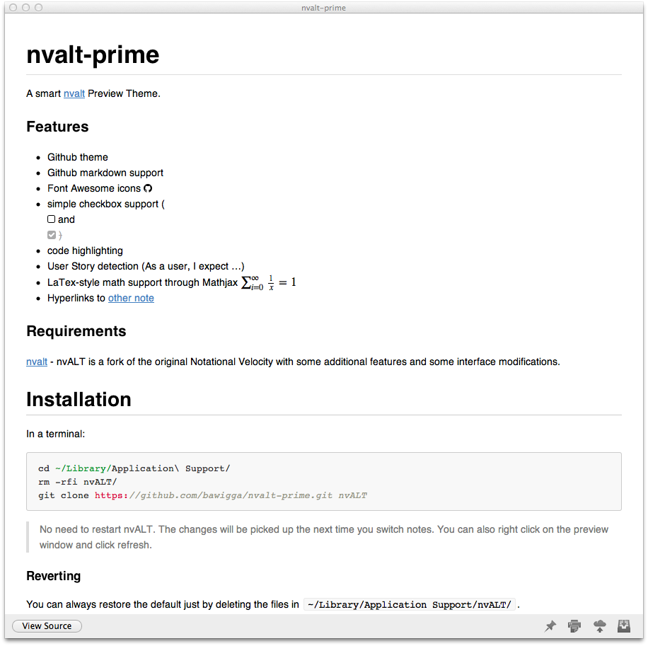

# nvalt-prime

[](https://gitter.im/bawigga/nvalt-prime?utm_source=badge&utm_medium=badge&utm_campaign=pr-badge&utm_content=badge)

A smart [nvalt](http://brettterpstra.com/projects/nvalt/) Preview Theme.

### Features

- Github theme
- Github markdown support
- Font Awesome icons [fa-github]
- simple checkbox support ([] and [/])
- code highlighting
- User Story detection (As a user, I expect ...)
- LaTex-style math support through Mathjax
- Hyperlinks to other notes
- Sort table rows by click on column headers (using Stuart Langridge's [sorttable.js](http://www.kryogenix.org/code/browser/sorttable/))
- footnotes appear in-place, rendered with [bigfoot.js](http://www.bigfootjs.com/)


### Tips
* This extensions of *nvALT prime* has been compiled to include support for code highlighting in some extra languages such as Rust, Clojure, Swift, ... You might want to get a customised version of *highlightjs* that includes support for your favorite languages. You can configure and download such a version from their [website](https://highlightjs.org/download/) and then substitute the "vanilla" library that bower imports for your custom one. Assuming you have downloaded the *highlightjs.zip* file to the `~/Downloads` folder, you can write

```
bower install
rm -rf bower_components/highlightjs/
mkdir bower_components/highlightjs
unzip ~/Downloads/highlightjs.zip -d bower_components/highlightjs
gulp
```

### Requirements

[nvalt](http://brettterpstra.com/projects/nvalt/) - nvALT is a fork of the original Notational Velocity with some additional features and some interface modifications.

## Installation

In a terminal:

    cd ~/Library/Application\ Support/
    rm -rfi nvALT/
    git clone --recursive https://github.com/dg2/nvalt-prime.git nvALT

> No need to restart nvALT. The changes will be picked up the next time you switch notes. You can also right click on the preview window and click refresh. The recursive clone is required to include Mathjax


#### Reverting

You can always restore the default just by deleting the files in `~/Library/Application Support/nvALT/`.

	rm -rfi ~/Library/Application\ Support/nvALT

#### Updating

In a terminal:

    cd ~/Library/Application\ Support/nvALT/
    git pull

#### Hacking

Just point `~/Library/Application Support/nvALT` to your local git repository.

	cd [your project path]
	git clone git@github.com:bawigga/nvalt-prime.git
	rm -rfi ~/Library/Application\ Support/nvALT
	ln -s /path/to/nvalt-prime/ ~/Library/Application\ Support/nvALT

> No need to restart nvALT. The changes will be picked up the next time you switch notes. You can also right click on the preview window and click refresh.

## Usage

> Please share how/why you use nvALT! Submit a quick comment on [issue #14](https://github.com/bawigga/nvalt-prime/issues/14)

### Checkboxes

There are two types of checkboxes you can use:

    [ ] - unchecked
    [/] - checked
    [ ] - checked @done

### Code Highlighting

    class SomeClass
        def someMethod
        end
    end

### Font Awesome Icons

    [fa-github]

### Github Markdown Theme

    strikethrough: wrap text with ~~

### Mathjax

For display mode, math formulae in [LaTeX notation](https://en.wikibooks.org/wiki/LaTeX/Mathematics#Sums_and_integrals) can be enclosed by `\\(` and  `\\)` or `\\[` `\\]`. For inline mode, it can be enclosed by `$$` and `$$`.
For example, the following code will display the quadratic equation in the same line as the text, but the two expressions for its solution on separate lines.

    The solutions of 
    $$ ax^2 + bx + c = 0 $$ 
    are
    \\( 
    x=\frac{-b + \sqrt{b^2-4ac\ }}{2a}.  
    \\)
    and
    \\[
    x=\frac{-b - \sqrt{b^2-4ac\ }}{2a}.  
    \\]

    
    \\[
    \sum_{x=1}^\infty \frac{1}{x} = 1
    \\]

## Sortable tables

Tables are automatically sortable: just click on the title to sort in ascending order, then click again to toggle between ascending and descending.

|Name|Country|Height|
|----|-------|----------|
|Tom|England| 1.9m|
|Bob|Scotland|2.0m|
|Sam|Ireland|1.8m|

## Footnotes
Footnotes are rendered using [bigfoot.js](http://www.bigfootjs.com/), so that they appear as easy-to-click buttons [^firstfootnote]; when the reader clicks on these, a popover appears.  This means the reader can read the note in-place, without jumping around the page [^secondfootnote]. 

When printed, the buttons are replaced by the more traditional numbers *in-situ* cross referencing the full text of the notes at the end of the document. This means the notes can still be read without interactivity.

[^firstfootnote]: Rather than as a number.

[^secondfootnote]: and, hopefully, be less distracted.
